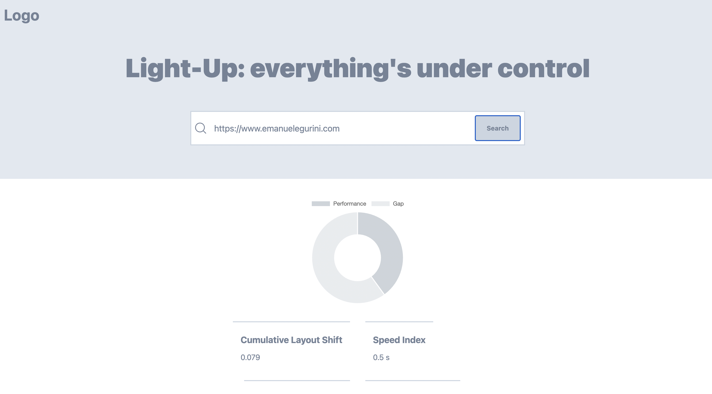
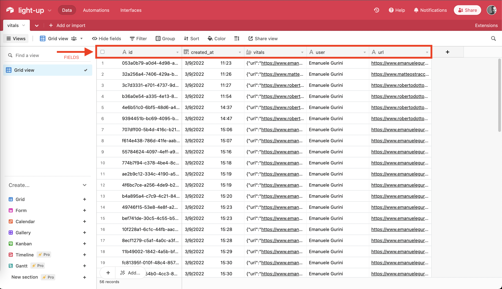
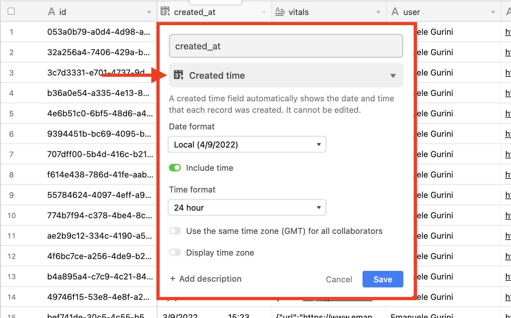

# This repo is not finished yet...

# Light-Up

Light-Up is an application that uses the Google Light-House API to analyze website metrics.

The peculiarity of Light-Up is the possibility of being able to carry out an analysis of a page with the analysis carried out previously on the same URL.

## User Journey:

1. the user enters the URL of the page to monitor (es. https://www.nomesito.dominio) and press the analyze button;

2. If the URL entered does not respect the parameters described above in the example, an error message is shown;

3. If the URL entered respects the correct structure, the Google Light House APIs are queried and return a JSON with all the data on the metrics of the website concerned;

4. The essential data of our interest are extracted from the JSON and saved on DB (AirTable). AirTable has a limit of 100,000 characters per field in the records, so it is not possible to save all the JSON that we initially received;

5. If the data is successfully saved on the DB, they are then recalled from the DB, together with all those corresponding to the URL entered in the input initially;

6. The search data is shown on the screen together with the data of the searches previously carried out on that particular URL.

## Stack:

- ReactJS
- Redux (State Manager)
- AirTable (DB)
- ChartJS
- MomentJS
- UUID

## Ligth-Up



## Installation

1. clone the repository

2.

```sh
npm install
```

3. Create your API Key from [Google API Light-House](https://developers.google.com/speed/docs/insights/v5/get-started)

4. Create you API key from AirTable [AirTable](https://airtable.com/)

5. Insert the API that you've creted before inside your .env, .env.production and .env.staging files

```env
REACT_APP_GOOGLE_API_KEY = ''
REACT_APP_AIRTABLE_API_KEY = ''
```

Please, check the following instruction, if you need:

[Environment Variables for a ReactJS App](https://dev.to/samirasaad/environment-variables-for-a-react-js-app-329j)

6. Go to AirTable and create a new DB Project with these features:

   - Create a workspace and name it 'light-up';
   - inside your workspace create a new table and name it 'vitals';
   - inside your table, create these following columns:

   

   1. id --> as single line text
   2. created_at --> as created time
      
   3. vitals --> as long text
   4. user --> as single line text
   5. url --> as single line text
